<p align="center">
  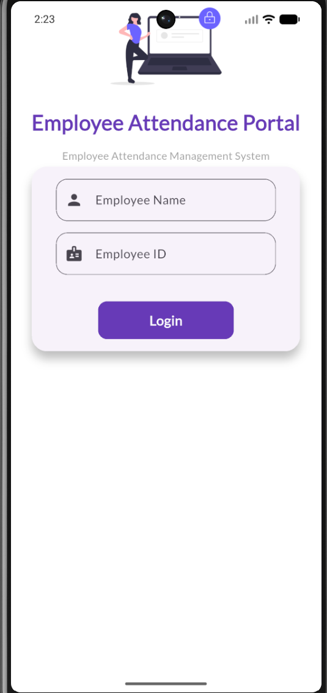
</p>

<p align="center">
  
  
  
  
  
</p>

# 📋 Employee Attendance Management System

A professional Flutter and Firebase-based Employee Attendance Management System developed as a final-year BCA project. The application provides separate Employee and Admin modules for attendance tracking, leave management, employee management, and report generation through a clean and user-friendly interface.

---

## About the Project

Employee Attendance Management System is a Flutter and Firebase-based mobile application designed to simplify attendance tracking for organizations. It provides separate Employee and Admin modules with real-time attendance management, leave approval, employee management, and reporting through Cloud Firestore.

---

## Project Objectives

- Automate employee attendance management.
- Provide separate Employee and Admin portals.
- Manage employee leave requests efficiently.
- Generate attendance reports.
- Store attendance records securely using Firebase Cloud Firestore.

---

## Features

### Employee Module

- Secure Employee Login
- Dashboard with Attendance Summary
- Punch In / Punch Out
- Attendance Calendar
- Leave Application
- Leave History
- Attendance Reports & Analytics
- Employee Profile

### Admin Module

- Admin Login
- Dashboard Overview
- Employee Management
- Employee Details
- Attendance Monitoring
- Leave Approval & Rejection
- Reports & Analytics Dashboard

---

## Tech Stack

- Flutter
- Dart
- Firebase Cloud Firestore
- SharedPreferences
- Table Calendar
- Material Design
- Android Studio
- Visual Studio Code

---

### Architecture

- Flutter Widgets
- StatefulWidget
- setState State Management
- Firebase Cloud Firestore

---

### Development Environment

- Flutter SDK
- Android Studio
- Visual Studio Code
- Firebase Console
- Git & GitHub

---

## Project Structure

```
lib/
│
├── pages/
│   ├── login_page.dart
│   ├── dashboard_page.dart
│   ├── attendance_page.dart
│   ├── leave_page.dart
│   ├── reports_page.dart
│   ├── profile_page.dart
│   │
│   ├── admin_dashboard.dart
│   ├── admin_employees_page.dart
│   ├── admin_employee_details.dart
│   ├── admin_attendance_page.dart
│   ├── admin_leave_page.dart
│   └── admin_reports_page.dart
│
├── utils/
│
└── main.dart
```

---


## Installation

1. Clone the repository

```bash
git clone https://github.com/parthsingh6/EmployeeAttendancePortal.git
```

2. Open the project in Visual Studio Code or Android Studio.

3. Install the dependencies

```bash
flutter pub get
```

4. Configure Firebase for your project by adding your own Firebase configuration files.

5. Run the application

```bash
flutter run
```

---


## Firestore Collections

| Collection | Purpose |
|------------|---------|
| employees | Stores employee information |
| attendance | Stores daily attendance records |
| leave_requests | Stores employee leave applications |

---

## Application Screenshots

<p align="center">

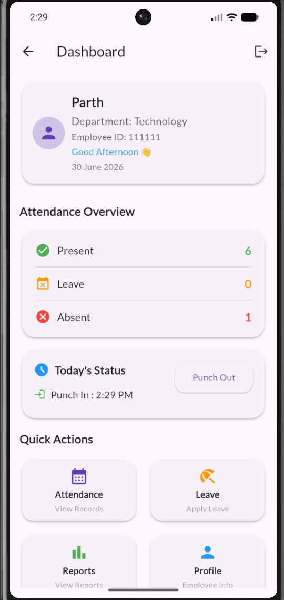
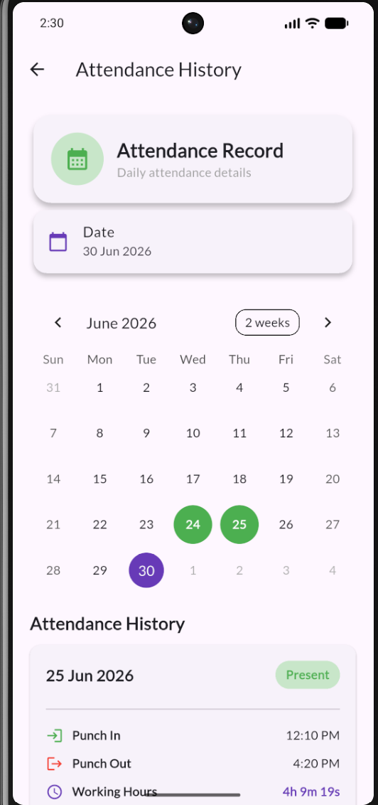
</p>

<p align="center">
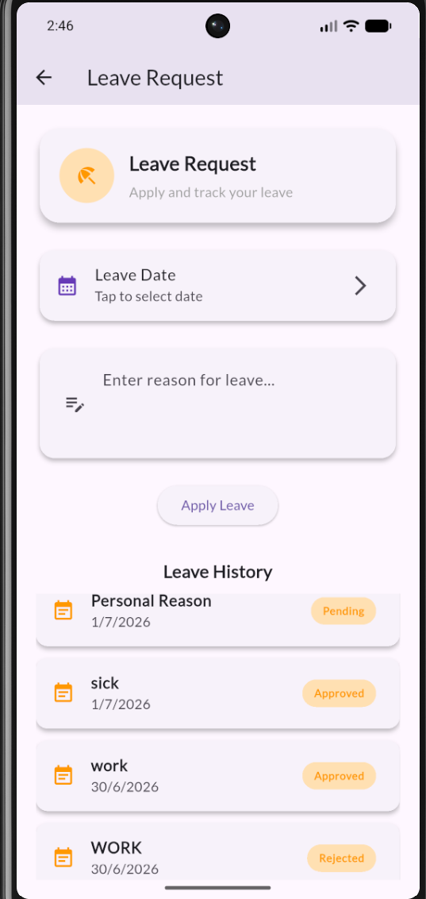
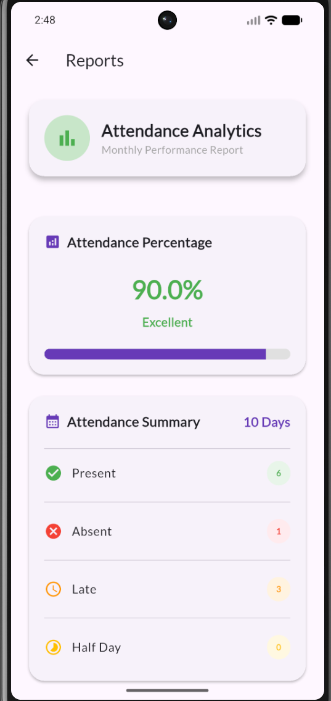
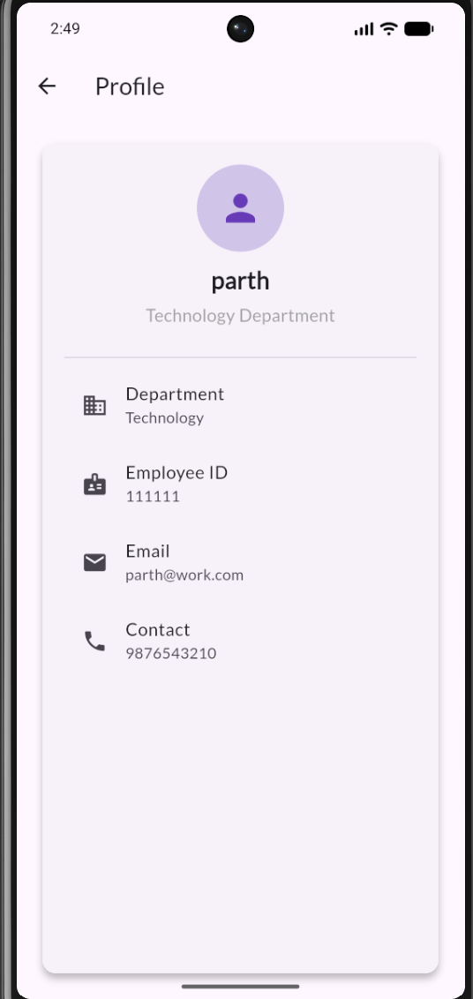
</p>

<p align="center">
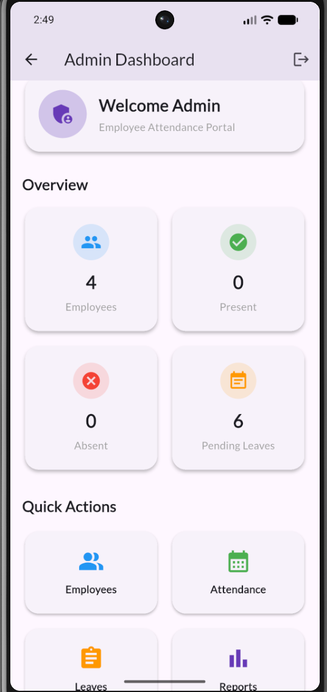
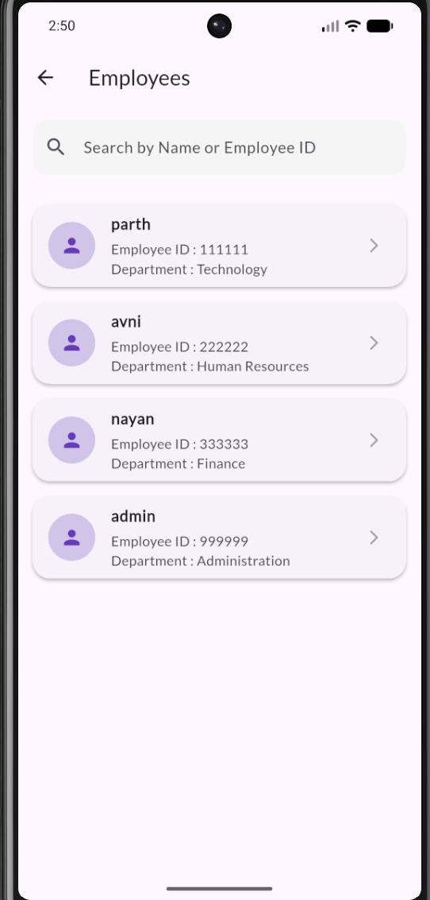
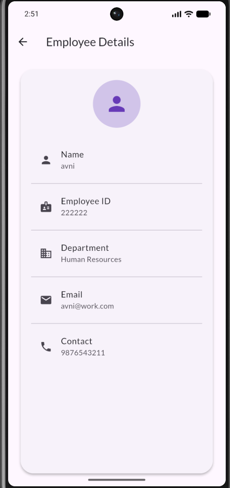
</p>

<p align="center">
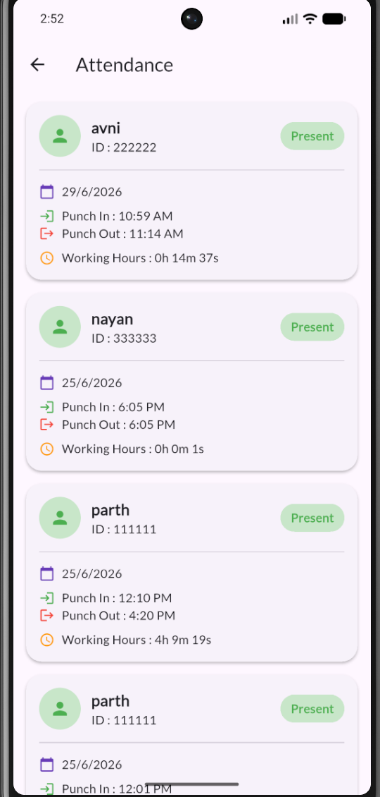
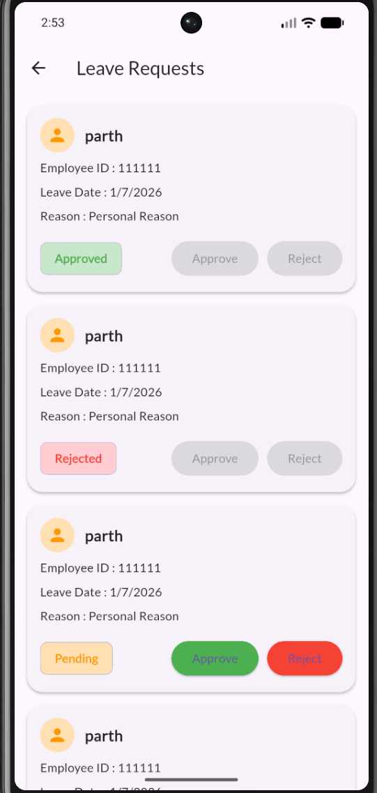
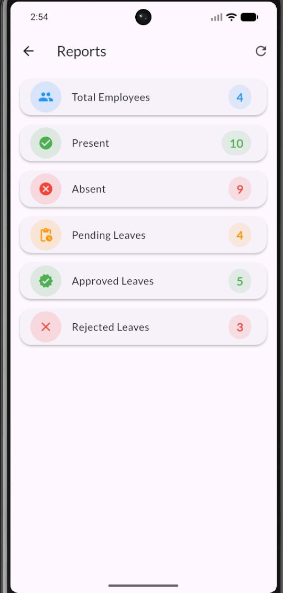
</p>

---

## Key Features

- Role-based Login (Employee/Admin)
- Attendance Punch In / Punch Out
- Leave Management
- Employee Management
- Attendance Reports
- Firebase Cloud Firestore Integration
- Responsive Material Design UI

---

## Project Statistics

- 12+ Screens Developed
- Employee & Admin Modules
- Firebase Cloud Firestore Integration
- Attendance & Leave Management
- Real-time Data Synchronization
- Material Design UI

---

## Future Enhancements

- Email & Password Authentication
- QR Code Attendance
- Face Recognition Attendance
- Push Notifications
- Excel/PDF Report Export
- Dark Mode
- Employee Photo Upload
- Attendance Analytics Dashboard
- Multi-Admin Support

---

## Learning Outcomes

Through this project, I gained hands-on experience with:

- Flutter UI Development
- Firebase Cloud Firestore Integration
- cloud_firestore
- CRUD Operations
- State Management using setState
- SharedPreferences
- Material Design
- Navigation & Routing
- Real-time Database Integration
- Mobile Application Development

---

## Developed By

**Parth Singh**

Final Year BCA Student

Jaypee Institute of Information Technology (JIIT)

Passionate about Flutter Development, Firebase, and Mobile Application Development.

---

## License

This project was developed for academic and educational purposes as part of a final-year BCA project.